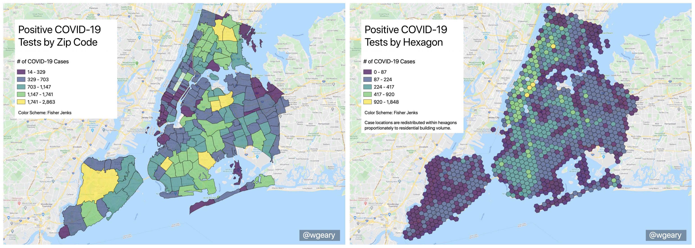

# Dasymetric Map of COVID Cases in New York City

Follow some conversation around this on [Twitter](https://twitter.com/wgeary/status/1252636419111165953?s=20).

STOP mapping COVID case counts by zip code! 🙅‍♀️🚫

Zip codes come in varying shapes and sizes, introducing bias known as the Modifiable Areal Unit Problem (MAUP).

These two maps both display the # of recorded COVID cases in NYC. Very different takeaways.

The map on the left is a simple choropleth map displaying raw counts of recorded COVID cases by zip code.

The map on the right is a dasymetric map which redistributes raw counts of recorded COVID cases from zip codes to residential buildings proportionate to building volume, and then re-aggregates by equal area hexagon.

There is some **seriously** flawed research going on right now which attempts to draw conclusions about how COVID spreads by simply overlying data on top of raw case counts by zip code. Please be aware of this!

COVID case counts should be accompanied by data on the total number of tests administered. It is flawed to draw conclusions about the spread of COVID without accounting for the number of tests administered. And it is flawed to aggregate this data by zip code.

